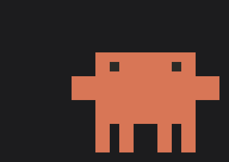

# claude-pet

A desktop mascot that shows what Claude Code is doing. It pulls a laptop out
of its pocket and starts typing when Claude works, stands still and waits when
Claude asks you something, and puts the laptop away when the job is done.



There are **two builds** in this repository, and they share everything that
matters — the same animation file, the same state machine, the same clip
timing, the same eight modules under `src/lib/`. They differ only in how the
mascot gets onto the screen.

| Your desktop | What to install | Read |
|---|---|---|
| **GNOME** (Wayland) | GNOME Shell 46 extension | this file |
| **KDE Plasma**, Sway, Hyprland, COSMIC (Wayland) | AppImage — one file, nothing to install | **[README-appimage.md](README-appimage.md)** |
| Any X11 session | neither — see [Why no X11](README-appimage.md#why-no-x11) | |

The split comes down to one protocol. `wlr-layer-shell` lets a client pin a
surface above everything else, pass clicks through, and never take focus.
KWin and wlroots speak it; GNOME's compositor Mutter does not. So on GNOME the
mascot is drawn *into the shell* by an extension, and everywhere else it is a
normal Wayland client using the protocol directly.

The rest of this file is about **the GNOME extension**.

**Target environment:** GNOME Shell 46 · Wayland · Zorin OS 18 / Ubuntu 24.04

---

## Requirements

| | |
|---|---|
| GNOME Shell | **46** (`gnome-shell --version`). `metadata.json` claims 46 only. |
| Session | Developed and measured on Wayland. Untested on X11. |
| Python | 3.8+ — the hook script uses the standard library only. |
| Claude Code | A version that supports hooks (`~/.claude/settings.json`). |
| Tools | `make`, `zip`, `glib-compile-schemas`, `gjs` (ship with GNOME) |

No sudo required: everything installs under `~/.local`.

`make gif` additionally wants Python `Pillow` — only to regenerate the GIF
above, it is not part of installing.

## Install

```sh
make check       # package check: metadata, assets, schema, syntax
make install     # installs under ~/.local/share/gnome-shell/extensions
make enable      # enables it in the real session
make hooks       # writes Claude Code hooks into ~/.claude/settings.json
```

`make hooks` leaves hooks you wrote by hand alone: it only adds its own
entries (the ones with `claude-pet-hook.py` on the command line), takes a
timestamped backup first, and writes the file atomically. Run
`make hooks-status` to see what got installed.

A Claude Code session that is already open may not pick up the new hooks
immediately; the reliable path is to start a new session.

To remove:

```sh
make uninstall   # extension + hook entries + event inbox
```

Settings (position, size) are deliberately left behind. To drop those too:

```sh
dconf reset -f /org/gnome/shell/extensions/claude-pet/
```

## Settings

**Right-click** the pet: Pause · Settings · Reset position.

| Setting | What it does |
|---|---|
| **Pet** | Master switch. Turned off, the mascot never appears — even while Claude is running. Process polling stops too. |
| Size | Pixel edge of one sprite cell (1–8). An integer, so scaling up does not blur. |
| Laptop | Whether the laptop layer is drawn. |
| Idle timeout | If no event arrives for this many seconds, the pet stops counting as working. 0: off. |
| Notify while waiting for input | Send a desktop notification when Claude Code asks a question. |
| Monitor | Which monitor the pet sits on. Falls back to the primary if that monitor is unplugged, and returns when it comes back. |

The pet is moved by **dragging**; where you drop it is saved relative to the
monitor, so it stays on screen even if the resolution changes.

## Why an extension and not a window

Wayland gives a client no way to position its own window, has no concept of
"always on top", and click-through cannot extend past a window's bounds.
GNOME's compositor Mutter does not support the `wlr-layer-shell` protocol
either — so the solution that works on Sway and Hyprland is unavailable here.
(That solution is exactly what the [AppImage build](README-appimage.md) uses.)

That leaves one clean option: do not open a window. The mascot is added
directly to GNOME Shell's scene graph as two Clutter actors — one for the
character, one for the laptop:

```js
Main.layoutManager.addChrome(area, {
    affectsStruts: false,       // does not disturb window layout
    affectsInputRegion: …,      // see the note below
    trackFullscreen: false,     // visible in fullscreen too
});
```

The laptop is a separate actor because it sits well to the left of the
character: as a single actor, the transparent gap between them would swallow
clicks too. The laptop actor receives no events at all.

> **Measured note:** `affectsInputRegion` does **nothing** on Wayland. In
> `ui/layout.js::_updateRegions()`,
> `wantsInputRegion = … && !Meta.is_wayland_compositor()`, so tracked actors
> are skipped entirely. What actually makes a piece click-through is
> `reactive: false`. The flag stays as a statement of intent (on X11 it really
> does define the input region).

The result: every pixel outside the character's rectangle passes clicks
through, the extension never takes focus, and it sits above the panel and
above fullscreen windows. No XWayland, no compositor tricks, no blurring at
fractional scaling.

### Being visible in fullscreen

Sitting on top of a fullscreen window is not just a stacking-order question.
After a while Mutter **unredirects** an opaque window that covers the whole
screen: it skips compositing entirely and scans the window's buffer straight
out. From that moment nothing in the shell's scene graph is drawn — not the
panel, not notifications, not the mascot. The symptom is distinctive: when a
window goes fullscreen the pet **appears first and vanishes a moment later.**

So the extension holds unredirect off with
`Meta.disable_unredirect_for_display()` (the shell does the same thing while
the overview is open) and adds its actors with `addTopChrome` rather than
`addChrome`.

**There is a cost:** fullscreen video and games no longer go straight to the
screen, they go through the compositing path. In games that can mean a few
frames per second. If you would rather not see the pet in fullscreen,
`make disable` (turning it off entirely — right-click → Pause is not enough)
gives unredirect back.

> The AppImage build does not pay this cost: on the `overlay` layer, being
> above fullscreen windows is what the protocol guarantees.

## When the pet exists

The pet exists while Claude is running, and does not exist otherwise.
"Running" is not "visible on screen": the desktop app may be in the
background, minimized, or behind another window — if the process is alive, so
is the pet. Claude Code opened in a terminal counts the same way.

| Master switch | Claude | Pet |
|---|---|---|
| on | desktop app (even in the background) | yes |
| on | `claude` in a terminal | yes |
| on | both | yes |
| on | neither | **no** |
| **off** | (doesn't matter) | **no** |

While the pet does not exist, the actors are hidden, no timer is armed, and
unredirect has been given back. With the master switch off, process polling
stops too — a disabled pet costs nothing.

With the switch off there is no pet on screen to click, so turning it back on
happens in the settings window:
`gnome-extensions prefs claude-pet@eymistaken.local`, or the Extensions app.

The test is **the process, not the window**: is there a process named
`claude-desktop` or `claude` in `/proc`. A window-based method
(`Shell.AppSystem`) would miss an app with no window, and would miss Claude
Code running in a terminal.

Since there is no unprivileged event source for process birth and death,
polling is unavoidable here. The cost has two tiers: while Claude is **open**
only the found process is checked for still being alive (one file, ~0.05 ms,
every 2 seconds); while it is **closed** a full scan is needed (365 processes,
~5.7 ms) and so it is asked every 8 seconds. The latency has a compensator on
the Claude Code side: the moment the first hook event arrives, the check runs
without waiting for the poll.

While the pet is off **unredirect is given back too**, so a fullscreen game
pays no compositing cost when Claude is not running.

## Where the state comes from

Claude Code's hooks. On every event a small Python script drops a JSON file
into `~/.local/state/claude-pet/inbox/`; the extension watches that directory
with `Gio.FileMonitor` — event-driven, no polling.

Seven events, three states. The tool name is not inspected: **any tool call
means "working".**

| Hook event | State |
|---|---|
| `UserPromptSubmit`, `PreToolUse` | **WORKING** — laptop comes out, types |
| `PermissionRequest`, `Notification`¹ | **WAITING** — puts the laptop away, waits |
| `Stop`, `SessionEnd` | **IDLE** — puts the laptop away, stands still |
| `StopFailure` (rate limit) | **IDLE** — laptop vanishes *without animation* |

¹ only the `permission_prompt`, `idle_prompt` and `agent_needs_input` types.

The state → clip mapping is a table (`src/lib/states.js`), not a chain of
`if`s:

```
sequence(A → B) = EXIT[A] + ENTER[B] + LOOP[B]
```

Two behavioural rules: typing mode is **sticky** (an intervening Read/Bash
does not put the laptop away), and an animation is **never cut mid-clip** (it
finishes the cycle it is in; the one exception is a rate limit).

If several Claude Code sessions run at once, a single aggregate state is kept:
**the most recent event wins.** There is one mascot on screen.

## Animations

Frames do not live in code, they live in `assets/animations.json`: each frame
is a grid of cells, each cell is body / eye / laptop / empty. Cairo draws them
as horizontal strips (~50 rectangles instead of 1961 cells in a 53×37 frame),
so it stays crisp at any scale and has no HiDPI problem.

Adding a new pose is drawing, not coding: `tools/extract_frames.py` pulls
frames out of a screen recording, you clean them up in the pose workshop, and
you put the JSON back. Details in `docs/KAYIT.md` and `docs/ANIMASYON.md`
(Turkish).

## Troubleshooting

**The pet is not on screen.**

```sh
gnome-extensions info claude-pet@eymistaken.local   # State should be ACTIVE
journalctl -o cat /usr/bin/gnome-shell | grep claude-pet
```

- `State: INITIALIZED` → installed but not enabled: `make enable`.
- If `gnome-extensions enable` says it does not exist, the shell has not
  scanned the new installation yet; wait a few seconds and retry.
- If the log has an `etkin · ızgara (x, y)` line the pet is being drawn but
  may be off screen: right-click → **Reset position**, or
  `dconf reset -f /org/gnome/shell/extensions/claude-pet/`.
- If the log says `animasyonlar yüklenemedi` the asset file is broken, and in
  that case the pet **does not appear at all** (see Known gaps).

**It says "this extension has no preferences" and the settings window will not
open.**

The shell computes `hasPrefs` **the first time it scans the extension** (at
session start) and never updates it. If `prefs.js` arrived later — or the
shell caught a half-written directory during install — the flag stays stuck at
`false`. `disable`/`enable` does not fix it.

```sh
gdbus call --session --dest org.gnome.Shell --object-path /org/gnome/Shell \
  --method org.gnome.Shell.Extensions.GetExtensionInfo claude-pet@eymistaken.local
```

If the output has `'hasPrefs': <false>` while `prefs.js` is on disk: **log out
and back in.** On Wayland there is no other way to restart the shell.

**The pet is there but does not react.**

```sh
make hooks-status          # 7 entries, and anything waiting in the inbox?
ls ~/.local/state/claude-pet/inbox/
```

- If the entry count is 0, run `make hooks`.
- An already-open Claude Code session may have read the old settings; start a
  new one.
- If files pile up in the inbox but the pet does not move, `Gio.FileMonitor`
  may have failed to install: check
  `cat /proc/sys/fs/inotify/max_user_instances` and look for
  `inbox izleyicisi kurulamadı` in the log. When the limit is exhausted the
  watcher **silently** does nothing.
- The pet may be paused: right-click → Resume.

**I changed the code and nothing happened.** GNOME 45+ caches ESM modules;
`disable`/`enable` does not re-read the JS (measured: after `make install`,
toggling off and on still logs lines from the old version). The shell reads
the module **the first time it enables the extension**; after that a changed
file only takes effect when the session restarts. That is why development
happens in a nested session: `make nested`.

## Known gaps

- **With a broken asset file the pet never appears.** `animations.js` falls
  back to an empty default and prints `console.warn`; there is no visible
  warning on screen.
- **There is no sleep pose.** The `sleep-timeout` setting makes the pet stop
  counting as working, but since the asset has no `sleep` clip the pet does
  not sleep, it stays in the neutral stance. Adding the clip needs no code
  change.
- **Unredirect is held off while Claude is open**, so fullscreen video and
  games cannot be scanned out directly. That is the price of visibility.
  While Claude is closed there is no price.
- **There is no setting for people who want the pet visible while Claude is
  closed.** The switch turns the pet off entirely; there is no "always show".
  The criterion is fixed: no Claude, no pet.
- **Screen scale (`scale_factor`) is not watched live.** Change the screen
  scale from 100% → 200% and the pet keeps the old cell size until the next
  settings change.
- **A small jump is possible if the state changes during a transition clip**
  (a 0.5–1.3 s window). The remaining sequence is dropped and replanned.
- **A left click does not pass through while the right-click menu is open**,
  it closes the menu. That is GNOME's own menu behaviour (modal grab), not a
  limitation of the extension.
- **Untested on X11.**

## Development

Two test hooks:

```sh
CLAUDE_PET_STATE_DIR=/tmp/pet-test   # where the hooks drop events
CLAUDE_PET_PROCESSES=cpetsahte       # changes the "is Claude open" criterion
```

Without the second one, trying this feature out would require whoever is
testing to close their own Claude — and Claude Code itself is that Claude.
Two things learned the hard way: **`sleep` cannot be used as a fake Claude**
(someone else's `sleep` may be running at any moment — one verification run
read a false "Claude open" because of it), and the name cannot exceed 15
characters, because `comm` is truncated.

```sh
make nested      # isolated test session (does not touch the real desktop)
make nested-log  # that session's log
make preview     # draw frames in a standalone window, never touching the shell
make replay      # exercise the hook → state → clip → position logic in isolation
make check       # package check
make pack        # distributable .zip
make gif         # regenerate docs/pet.gif
```

`make replay` runs four test files (110 assertions). To run one:
`gjs -m tests/director.js`.

When working on the art use `make preview`, not `make nested` — it is much
faster.

For the AppImage build, see [README-appimage.md](README-appimage.md).
Contributor-facing architecture notes live in `CLAUDE.md` (Turkish).

The roadmap is in `docs/PLAN.md`, phase by phase. Each phase's ready-made
prompt for Claude Code is under `prompts/`, and what was actually done — with
the measurements behind each decision — is in `docs/ILERLEME.md`.

## Licence, and about the character

The code is MIT licensed — see `LICENSE`.

The mascot is Anthropic's Claude Code character. This project is **not
official** and is an independent piece of fan work. No claim is made over the
character's artwork. It will be taken down if Anthropic asks.
